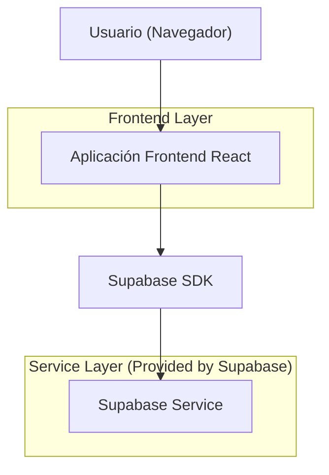
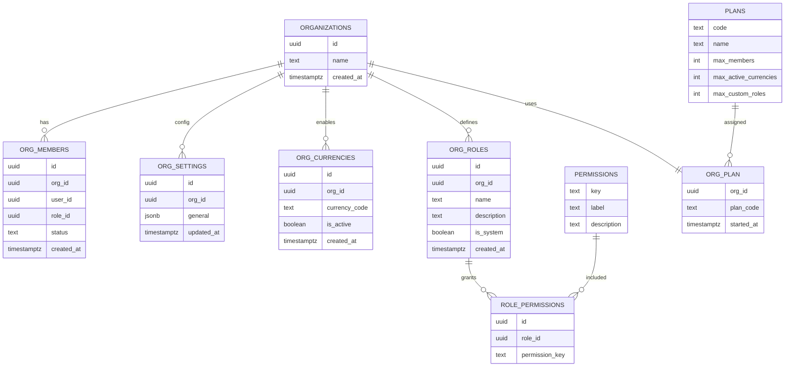

## 1.Architecture design


## 2.Technology Description
- Frontend: React@18 + vite + tailwindcss@3
- Backend: Supabase (Auth + Database PostgreSQL)

## 3.Route definitions
| Route | Purpose |
|-------|---------|
| /configuracion | Pantalla de configuración con pestañas Planes/General/Monedas/Equipo/Roles/Permisos |

## 6.Data model(if applicable)

### 6.1 Data model definition


### 6.2 Data Definition Language
Planes y límites (valores iniciales sugeridos; pueden ajustarse):
- Gratis: miembros 3, monedas activas 2, roles personalizados 2
- Premium: miembros 999999, monedas activas 999999, roles personalizados 999999

```sql
-- ORGANIZATIONS
CREATE TABLE organizations (
  id UUID PRIMARY KEY DEFAULT gen_random_uuid(),
  name TEXT NOT NULL,
  created_at TIMESTAMPTZ NOT NULL DEFAULT now()
);

-- ORG_SETTINGS (general se guarda como jsonb para flexibilidad)
CREATE TABLE org_settings (
  id UUID PRIMARY KEY DEFAULT gen_random_uuid(),
  org_id UUID NOT NULL,
  general JSONB NOT NULL DEFAULT '{}'::jsonb,
  updated_at TIMESTAMPTZ NOT NULL DEFAULT now()
);

-- PLANS
CREATE TABLE plans (
  code TEXT PRIMARY KEY,
  name TEXT NOT NULL,
  max_members INT NOT NULL,
  max_active_currencies INT NOT NULL,
  max_custom_roles INT NOT NULL
);

-- ORG_PLAN (un plan vigente por organización)
CREATE TABLE org_plan (
  org_id UUID PRIMARY KEY,
  plan_code TEXT NOT NULL,
  started_at TIMESTAMPTZ NOT NULL DEFAULT now()
);

-- ORG_ROLES (roles personalizados editables/eliminables; is_system protege roles base)
CREATE TABLE org_roles (
  id UUID PRIMARY KEY DEFAULT gen_random_uuid(),
  org_id UUID NOT NULL,
  name TEXT NOT NULL,
  description TEXT,
  is_system BOOLEAN NOT NULL DEFAULT false,
  created_at TIMESTAMPTZ NOT NULL DEFAULT now()
);

-- PERMISSIONS (catálogo)
CREATE TABLE permissions (
  key TEXT PRIMARY KEY,
  label TEXT NOT NULL,
  description TEXT
);

-- ROLE_PERMISSIONS (asignación de permisos por rol)
CREATE TABLE role_permissions (
  id UUID PRIMARY KEY DEFAULT gen_random_uuid(),
  role_id UUID NOT NULL,
  permission_key TEXT NOT NULL
);

-- ORG_MEMBERS (miembros y su rol)
CREATE TABLE org_members (
  id UUID PRIMARY KEY DEFAULT gen_random_uuid(),
  org_id UUID NOT NULL,
  user_id UUID NOT NULL,
  role_id UUID,
  status TEXT NOT NULL DEFAULT 'active',
  created_at TIMESTAMPTZ NOT NULL DEFAULT now()
);

-- ORG_CURRENCIES
CREATE TABLE org_currencies (
  id UUID PRIMARY KEY DEFAULT gen_random_uuid(),
  org_id UUID NOT NULL,
  currency_code TEXT NOT NULL,
  is_active BOOLEAN NOT NULL DEFAULT true,
  created_at TIMESTAMPTZ NOT NULL DEFAULT now()
);

-- Indices recomendados
CREATE INDEX idx_org_members_org_id ON org_members(org_id);
CREATE INDEX idx_org_roles_org_id ON org_roles(org_id);
CREATE INDEX idx_org_currencies_org_id ON org_currencies(org_id);
CREATE INDEX idx_role_permissions_role_id ON role_permissions(role_id);

-- Seeds: planes
INSERT INTO plans (code, name, max_members, max_active_currencies, max_custom_roles)
VALUES
  ('free', 'Gratis', 3, 2, 2),
  ('premium', 'Premium', 999999, 999999, 999999);

-- Seeds: permisos (ejemplo mínimo para esta pantalla)
INSERT INTO permissions (key, label, description)
VALUES
  ('settings.view', 'Ver configuración', 'Permite acceder a la pantalla de configuración.'),
  ('settings.plans.manage', 'Gestionar planes', 'Permite ver/cambiar el plan y sus límites.'),
  ('settings.general.manage', 'Gestionar general', 'Permite editar parámetros generales.'),
  ('settings.currencies.manage', 'Gestionar monedas', 'Permite activar/desactivar monedas.'),
  ('settings.team.manage', 'Gestionar equipo', 'Permite invitar/quitar miembros y asignar roles.'),
  ('settings.roles.manage', 'Gestionar roles', 'Permite crear/editar/eliminar roles personalizados.'),
  ('settings.permissions.manage', 'Gestionar permisos', 'Permite asignar permisos a roles.');

-- Grants (guía base)
GRANT SELECT ON organizations TO anon;
GRANT ALL PRIVILEGES ON organizations TO authenticated;

GRANT SELECT ON org_settings TO anon;
GRANT ALL PRIVILEGES ON org_settings TO authenticated;

GRANT SELECT ON plans TO anon;
GRANT ALL PRIVILEGES ON plans TO authenticated;

GRANT SELECT ON org_plan TO anon;
GRANT ALL PRIVILEGES ON org_plan TO authenticated;

GRANT SELECT ON org_roles TO anon;
GRANT ALL PRIVILEGES ON org_roles TO authenticated;

GRANT SELECT ON permissions TO anon;
GRANT ALL PRIVILEGES ON permissions TO authenticated;

GRANT SELECT ON role_permissions TO anon;
GRANT ALL PRIVILEGES ON role_permissions TO authenticated;

GRANT SELECT ON org_members TO anon;
GRANT ALL PRIVILEGES ON org_members TO authenticated;

GRANT SELECT ON org_currencies TO anon;
GRANT ALL PRIVILEGES ON org_currencies TO authenticated;
```
