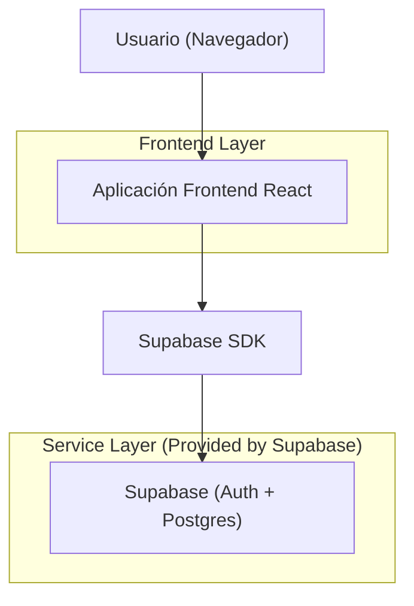
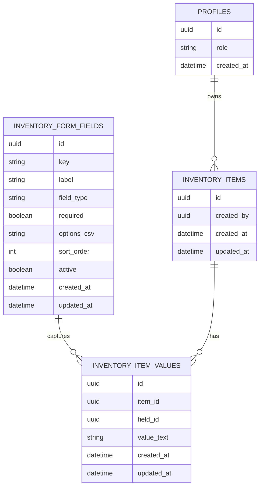

## 1.Architecture design


## 2.Technology Description
- Frontend: React@18 + TypeScript + vite + tailwindcss@3
- Backend: Supabase (Auth + PostgreSQL + RLS)

## 3.Route definitions
| Route | Purpose |
|-------|---------|
| /login | Inicio de sesión y establecimiento de sesión |
| /inventario | Listado de ítems y acciones CRUD según rol |
| /inventario/nuevo | Alta de ítem con formulario dinámico |
| /inventario/:id | Edición/lectura de ítem con formulario dinámico |
| /inventario/config-formulario | CRUD de campos + reordenamiento (solo Admin) |

## 6.Data model(if applicable)

### 6.1 Data model definition


### 6.2 Data Definition Language
Profiles (profiles)
```sql
CREATE TABLE profiles (
  id UUID PRIMARY KEY,
  role TEXT NOT NULL CHECK (role IN ('admin','inventory_manager','viewer')),
  created_at TIMESTAMPTZ DEFAULT now()
);

-- Permisos (modelo simple):
-- 1) anon solo autenticación (sin acceso a tablas de negocio)
-- 2) authenticated acceso según RLS
GRANT SELECT ON profiles TO anon;
GRANT ALL PRIVILEGES ON profiles TO authenticated;
```

Definición de campos (inventory_form_fields)
```sql
CREATE TABLE inventory_form_fields (
  id UUID PRIMARY KEY DEFAULT gen_random_uuid(),
  key TEXT NOT NULL,
  label TEXT NOT NULL,
  field_type TEXT NOT NULL CHECK (field_type IN ('text','number','date','textarea','select','multiselect')),
  required BOOLEAN NOT NULL DEFAULT false,
  options_csv TEXT NULL, -- opciones en texto separado por comas (no JSON)
  sort_order INT NOT NULL DEFAULT 0,
  active BOOLEAN NOT NULL DEFAULT true,
  created_at TIMESTAMPTZ DEFAULT now(),
  updated_at TIMESTAMPTZ DEFAULT now()
);

CREATE UNIQUE INDEX inventory_form_fields_key_uk ON inventory_form_fields(key);
CREATE INDEX inventory_form_fields_sort_idx ON inventory_form_fields(sort_order);

GRANT SELECT ON inventory_form_fields TO anon;
GRANT ALL PRIVILEGES ON inventory_form_fields TO authenticated;
```

Ítems (inventory_items)
```sql
CREATE TABLE inventory_items (
  id UUID PRIMARY KEY DEFAULT gen_random_uuid(),
  created_by UUID NOT NULL,
  created_at TIMESTAMPTZ DEFAULT now(),
  updated_at TIMESTAMPTZ DEFAULT now()
);

CREATE INDEX inventory_items_created_by_idx ON inventory_items(created_by);

GRANT SELECT ON inventory_items TO anon;
GRANT ALL PRIVILEGES ON inventory_items TO authenticated;
```

Valores por campo (inventory_item_values)
```sql
CREATE TABLE inventory_item_values (
  id UUID PRIMARY KEY DEFAULT gen_random_uuid(),
  item_id UUID NOT NULL,
  field_id UUID NOT NULL,
  value_text TEXT NULL,
  created_at TIMESTAMPTZ DEFAULT now(),
  updated_at TIMESTAMPTZ DEFAULT now()
);

CREATE INDEX inventory_item_values_item_idx ON inventory_item_values(item_id);
CREATE INDEX inventory_item_values_field_idx ON inventory_item_values(field_id);

GRANT SELECT ON inventory_item_values TO anon;
GRANT ALL PRIVILEGES ON inventory_item_values TO authenticated;
```

RLS (esquema recomendado, a completar en Supabase)
```sql
-- Nota: se recomienda habilitar RLS en las 3 tablas de negocio.
-- Lectura: viewer / inventory_manager / admin
-- Escritura (insert/update/delete): inventory_manager y admin
-- Configuración de formulario: solo admin

-- Ejemplo de predicate (patrón):
-- EXISTS (SELECT 1 FROM profiles p WHERE p.id = auth.uid() AND p.role = 'admin')
```