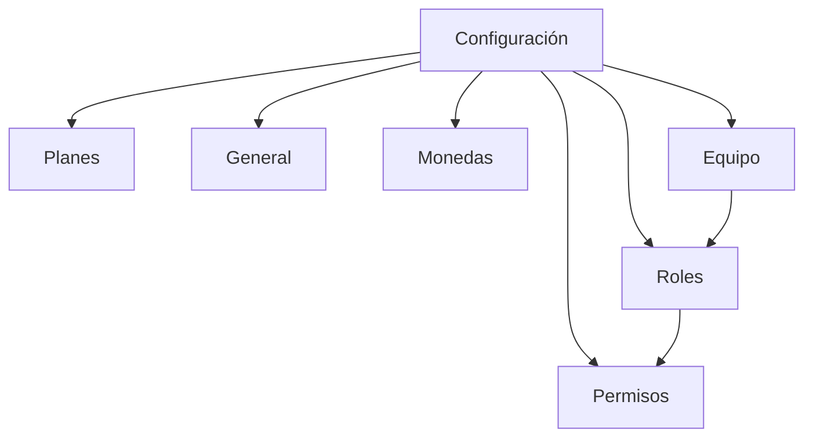

## 1. Product Overview
Pantalla de **Configuración** para administrar plan, parámetros generales, monedas, equipo y control de acceso por roles/permisos.
Está orientada a administradores/propietarios que gestionan los límites del plan y la seguridad del sistema.

## 2. Core Features

### 2.1 User Roles
| Rol | Método de alta | Permisos principales |
|------|----------------|----------------------|
| Propietario / Administrador | Invitación o asignación interna | Puede gestionar Planes, General, Monedas, Equipo, Roles y Permisos. |
| Miembro | Invitación al equipo | Acceso según permisos asignados a su rol. |

> Nota: **No existe rol “Visualizador”** predefinido. Los accesos se controlan mediante **roles personalizados** (editables/eliminables) + permisos.

### 2.2 Feature Module
La pantalla de configuración consiste en una sola página con pestañas:
1. **Configuración**: pestañas Planes, General, Monedas, Equipo, Roles, Permisos; gestión de límites del plan y control de acceso.

### 2.3 Page Details
| Page Name | Module Name | Feature description |
|-----------|-------------|---------------------|
| Configuración | Navegación por pestañas | Cambiar entre **Planes/General/Monedas/Equipo/Roles/Permisos** manteniendo el contexto de la organización/empresa. |
| Configuración | Planes | Mostrar planes **Gratis/Premium** con sus **límites**; indicar el **plan actual** con una marca visible; mostrar acciones disponibles para cambiar de plan. |
| Configuración | General | Editar y guardar parámetros generales del sistema/empresa (campos configurables); validar campos y confirmar guardado. |
| Configuración | Monedas | Listar monedas disponibles/activas; activar/desactivar monedas; respetar límites del plan (p.ej. máximo de monedas activas). |
| Configuración | Equipo | Listar miembros del equipo; invitar/agregar miembros; quitar miembros; asignar rol a cada miembro; respetar límites del plan (p.ej. máximo de miembros). |
| Configuración | Roles | Listar roles existentes; crear roles personalizados; **editar** nombre/detalles; **eliminar** roles personalizados; impedir acciones inválidas (p.ej. eliminar rol en uso sin reasignación). |
| Configuración | Permisos | Listar catálogo de permisos; asignar/quitar permisos a un rol; guardar cambios; aplicar cambios al acceso efectivo de los miembros. |

## 3. Core Process
**Flujo Administrador/Propietario (Configuración):**
1) Entra a Configuración y navega por pestañas.
2) En **Planes**, compara Gratis/Premium, ve límites y el “Plan actual”, y cambia de plan si corresponde.
3) En **General**, actualiza datos generales y guarda.
4) En **Monedas**, activa/desactiva monedas y confirma cambios (con bloqueo por límites si aplica).
5) En **Equipo**, invita o gestiona miembros y asigna roles.
6) En **Roles**, crea/edita/elimina roles personalizados.
7) En **Permisos**, configura permisos por rol y guarda; los accesos del equipo se actualizan.

