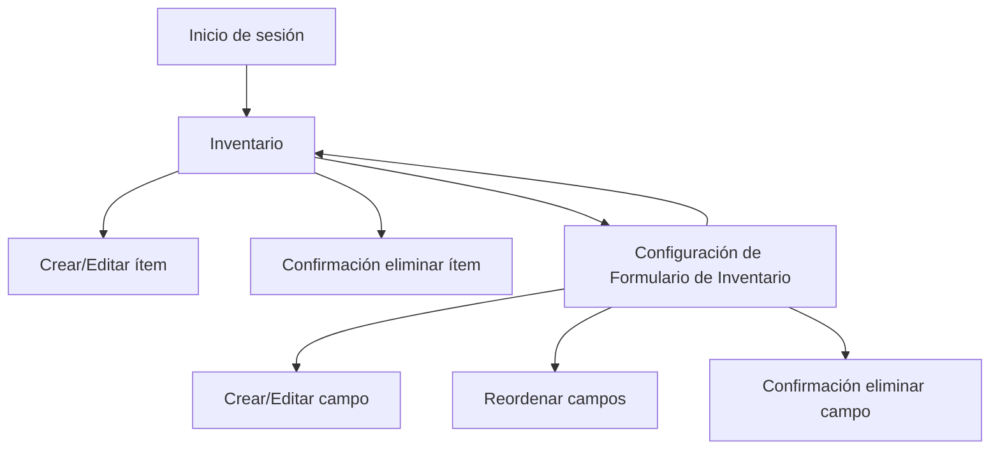

## 1. Product Overview
Rediseño del módulo Inventario para permitir formularios dinámicos configurables, reordenables y con CRUD completo.
El objetivo es que puedas definir campos (incluyendo selecciones por texto con comas) y controlar el acceso por roles con confirmación al eliminar.

## 2. Core Features

### 2.1 User Roles
| Rol | Método de registro | Permisos clave |
|------|---------------------|----------------|
| Administrador | Creado por administración interna | Configura formulario dinámico, gestiona inventario (CRUD), define permisos/roles (si aplica), elimina con confirmación |
| Encargado de Inventario | Asignación por Administrador | Gestiona inventario (CRUD), ve formulario dinámico, no cambia configuración del formulario |
| Lector | Asignación por Administrador | Solo lectura de inventario (sin crear/editar/eliminar) |

### 2.2 Feature Module
1. **Inventario**: listado, búsqueda/filtros básicos, alta/edición con formulario dinámico, eliminación con confirmación.
2. **Configuración de Formulario de Inventario**: creador de campos, opciones de selección por texto separado por comas, reordenamiento (drag&drop y flechas), CRUD de campos.
3. **Inicio de sesión**: autenticación y control de acceso por rol.

### 2.3 Page Details
| Page Name | Module Name | Feature description |
|-----------|-------------|---------------------|
| Inicio de sesión | Autenticación | Iniciar sesión y establecer sesión para habilitar permisos por rol. |
| Inventario | Listado | Ver listado de ítems; buscar/filtrar; mostrar columnas clave y acceso a acciones según rol. |
| Inventario | Crear/Editar ítem | Crear/editar ítems usando el formulario dinámico vigente; validar campos requeridos y tipos. |
| Inventario | Eliminar ítem | Confirmar eliminación (modal) y ejecutar borrado solo si el rol lo permite. |
| Configuración de Formulario de Inventario | Listado de campos | Ver campos existentes con tipo, requerido, y orden; permitir acciones según rol. |
| Configuración de Formulario de Inventario | Crear/Editar campo | Definir nombre/etiqueta, tipo, requerido, ayuda; para selecciones capturar opciones como texto con comas (sin JSON) y normalizar (trim, quitar vacíos). |
| Configuración de Formulario de Inventario | Reordenamiento de campos | Reordenar campos mediante drag&drop y también con flechas arriba/abajo; persistir el orden. |
| Configuración de Formulario de Inventario | Eliminar campo | Confirmar eliminación (modal) y eliminar solo si el rol lo permite; prevenir inconsistencias (por ejemplo, aviso si impacta datos existentes). |

## 3. Core Process
**Flujo Administrador**
1) Inicias sesión. 2) Entras a Configuración de Formulario. 3) Creas/editar campos. 4) Para campos de selección, escribes opciones separadas por comas. 5) Reordenas campos con drag&drop o flechas. 6) Guardas. 7) Vuelves a Inventario y creas/editar ítems con el formulario actualizado. 8) Si eliminas un ítem/campo, confirmas en modal.

**Flujo Encargado de Inventario**
1) Inicias sesión. 2) Entras a Inventario. 3) Creas/editar ítems usando el formulario dinámico. 4) Eliminas ítems con confirmación (si tu rol lo permite).

**Flujo Lector**
1) Inicias sesión. 2) Entras a Inventario. 3) Solo consultas listado y detalle/edición en modo lectura (sin guardar).

